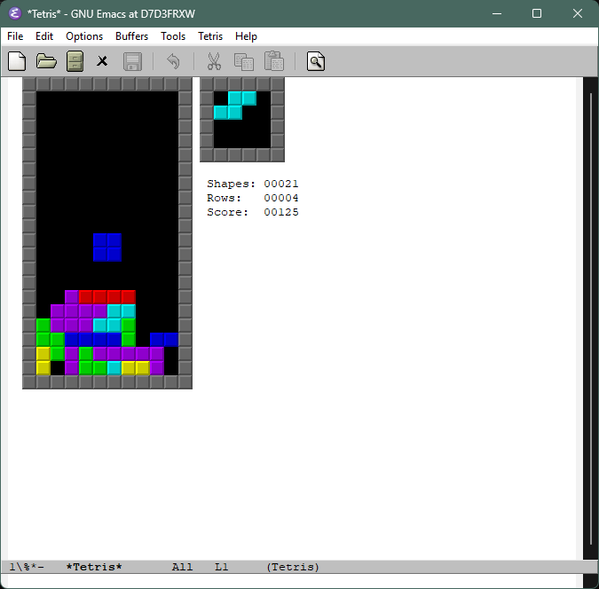

[](https://www.gnu.org/licenses/gpl-3.0)
[](https://emacs-eine.github.io/elpa/#/run-tetris)

# run-tetris
> Play tetris

[](https://github.com/emacs-eine/run-tetris/actions/workflows/test.yml)



## 💾 Installation

You need to add this line to your Eask file (global recommanded).

```elisp
(source 'gnu)
(source 'melpa)
(source 'jcs-elpa)
(source 'eine)
```

Then, install it:

```console
eask install -g run-tetris
```

## 🔧 Usage

To run the simple http server:

```console
eask -g exec run-tetris
```

## 🛠️ Contribute

[](http://makeapullrequest.com)
[](https://github.com/bbatsov/emacs-lisp-style-guide)
[](https://www.paypal.me/jcs090218)
[](https://www.patreon.com/jcs090218)

If you would like to contribute to this project, you may either
clone and make pull requests to this repository. Or you can
clone the project and establish your own branch of this tool.
Any methods are welcome!

### 🔬 Development

To run the test locally, you will need the following tools:

- [Eask](https://emacs-eask.github.io/)
- [Make](https://www.gnu.org/software/make/) (optional)

Link this package as a global dependency:

```sh
eask -g link add run-tetris </path/to/project/dir/>
```

Then execute the command:

```sh
eask -g exec run-tetris --help
```

*📝 P.S. For more information, find the Eask manual at https://emacs-eask.github.io/.*

## ⚜️ License

This program is free software; you can redistribute it and/or modify
it under the terms of the GNU General Public License as published by
the Free Software Foundation, either version 3 of the License, or
(at your option) any later version.

This program is distributed in the hope that it will be useful,
but WITHOUT ANY WARRANTY; without even the implied warranty of
MERCHANTABILITY or FITNESS FOR A PARTICULAR PURPOSE.  See the
GNU General Public License for more details.

You should have received a copy of the GNU General Public License
along with this program.  If not, see <https://www.gnu.org/licenses/>.

See [`LICENSE`](./LICENSE) for details.
